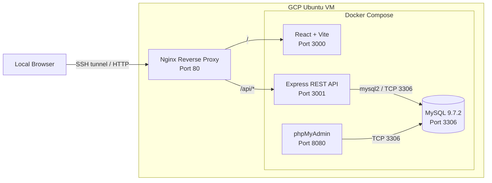

# Full-Stack Docker Compose CRUD Lab

[](https://www.docker.com/)
[](https://react.dev/)
[](https://expressjs.com/)
[](https://www.mysql.com/)
[](https://nginx.org/)
[](LICENSE)

A hands-on full-stack and DevOps lab demonstrating a React frontend, Express REST API, MySQL database, and phpMyAdmin orchestrated with Docker Compose, with host-level Nginx providing reverse-proxy routing.

The application implements a complete user CRUD workflow and is intentionally structured to demonstrate container networking, health-aware dependencies, persistent storage, environment-based configuration, localhost-only service publishing, SSH tunneling, and reverse proxying through a single application entry point.

> **Project scope:** this repository is a learning and portfolio project. The frontend currently runs with the Vite development server, and Nginx runs on the Ubuntu VM host rather than as a Docker container. This is not intended to represent a production deployment architecture yet.

## Highlights

- Complete **Create / Read / Update / Delete** user workflow
- React frontend using relative `/api/...` requests
- Host-level **Nginx reverse proxy** as the application HTTP entry point
- Express REST API backed by MySQL
- MySQL initialization SQL and persistent Docker volume
- MySQL health check before backend startup
- phpMyAdmin for database inspection and administration
- Internal Docker bridge network for service-to-service communication
- Environment variables stored outside source control
- Docker services published only on `127.0.0.1` on the VM
- Remote-lab access through SSH local port forwarding
- Dockerized frontend and backend builds

## Architecture



### Request flow

```text
Local Browser
     |
     | http://127.0.0.1:8081
     v
SSH local port forwarding
     |
     | 8081 -> VM 127.0.0.1:80
     v
Nginx :80
  |
  +-- /       --> React + Vite :3000
  |
  +-- /api/   --> Express API :3001
                       |
                       | mysql2 / TCP 3306
                       v
                     MySQL
                       |
                       v
                persistent volume
```

The React frontend uses relative API paths such as `/api/users`. This keeps the browser on the Nginx entry point instead of calling `localhost:3001` directly.

The host-level Nginx configuration uses path-based routing:

```nginx
location / {
    proxy_pass http://127.0.0.1:3000;
}

location /api/ {
    proxy_pass http://127.0.0.1:3001/;
}
```

The trailing slash in `proxy_pass http://127.0.0.1:3001/;` means a request such as `/api/users` is forwarded to the backend as `/users`.

The Express backend connects to MySQL through Docker DNS using the service hostname `mysql`. phpMyAdmin connects to MySQL through the same Docker network.

## Technology Stack

| Layer | Technology | Purpose |
|---|---|---|
| Reverse proxy | Nginx 1.24 on Ubuntu VM | Single HTTP entry point and path-based routing |
| Frontend | React 19 + Vite 8 | User interface and browser-side API calls |
| Backend | Node.js 22 + Express 5 | REST API and application logic |
| Database client | mysql2 | Promise-based MySQL connection pool |
| Database | MySQL 9.7.2 | Persistent application data |
| DB administration | phpMyAdmin | Browser-based database inspection |
| Containers | Docker | Application packaging |
| Orchestration | Docker Compose | Multi-container lifecycle and networking |
| Networking | Docker bridge network | Service discovery and internal connectivity |
| Persistence | Docker named volume | MySQL data persistence |
| Remote access | SSH local port forwarding | Access VM-local services without directly publishing them to the Internet |

## Project Structure

```text
fullstack-docker-compose/
├── .env.example
├── .gitignore
├── docker-compose.yml
├── LICENSE
├── README.md
│
├── backend/
│   ├── .dockerignore
│   ├── Dockerfile
│   ├── index.js
│   ├── package.json
│   └── package-lock.json
│
├── frontend/
│   ├── .dockerignore
│   ├── Dockerfile
│   ├── package.json
│   ├── vite.config.js
│   ├── public/
│   └── src/
│       ├── App.jsx
│       ├── App.css
│       ├── index.css
│       └── main.jsx
│
└── mysql/
    └── init.sql
```

> Nginx is currently configured on the Ubuntu VM host, so its active site configuration is not part of the Docker Compose service tree shown above.

## API Endpoints

The Express application defines the following backend routes. Through Nginx, the browser-facing form is prefixed with `/api`.

| Method | Backend route | Through Nginx | Purpose | Success |
|---|---|---|---|---|
| `GET` | `/health` | `/api/health` | Check API and database connectivity | `200` |
| `GET` | `/users` | `/api/users` | List users | `200` |
| `POST` | `/users` | `/api/users` | Create a user | `201` |
| `PUT` | `/users/:id` | `/api/users/:id` | Update a user | `200` |
| `DELETE` | `/users/:id` | `/api/users/:id` | Delete a user | `200` |

Test through Nginx on the VM:

```bash
curl http://127.0.0.1/api/health
curl http://127.0.0.1/api/users
```

Expected health response:

```json
{
  "status": "ok",
  "database": "connected"
}
```

Example user creation through Nginx:

```bash
curl -X POST http://127.0.0.1/api/users \
  -H "Content-Type: application/json" \
  -d '{"name":"Demo User","email":"demo@example.com"}'
```

For backend-only troubleshooting, the API remains bound to VM loopback at `127.0.0.1:3001`.

## Database Initialization

On the first initialization of the MySQL data directory, Docker mounts:

```text
mysql/init.sql
```

into:

```text
/docker-entrypoint-initdb.d/01-init.sql
```

The script creates the `users` table and inserts sample records. The email column has a unique constraint.

Because MySQL data is stored in the named volume `fullstack_mysql_data`, application data survives normal container recreation.

```bash
docker compose down
docker compose up -d
```

The named volume is preserved by the commands above.

> Running `docker compose down -v` removes the named volume and therefore deletes the persisted MySQL data for this Compose project.

## Getting Started

### Prerequisites

Install:

- Git
- Docker Engine
- Docker Compose v2
- Nginx on the Ubuntu VM host for the reverse-proxy phase
- SSH client when accessing the lab remotely

Verify Docker Compose:

```bash
docker compose version
```

### 1. Clone the repository

```bash
git clone git@github.com:DerbSwag/fullstack-docker-compose.git
cd fullstack-docker-compose
```

HTTPS can also be used:

```bash
git clone https://github.com/DerbSwag/fullstack-docker-compose.git
cd fullstack-docker-compose
```

### 2. Create the environment file

```bash
cp .env.example .env
```

Then edit `.env` and replace the example credentials:

```dotenv
MYSQL_ROOT_PASSWORD=change_me
MYSQL_DATABASE=fullstack
MYSQL_USER=appuser
MYSQL_PASSWORD=change_me
```

The real `.env` file is excluded from Git by `.gitignore`.

### 3. Build and start the Docker Compose stack

```bash
docker compose up -d --build
```

### 4. Verify container status

```bash
docker compose ps
```

Expected services:

```text
fullstack-mysql
fullstack-backend
fullstack-frontend
fullstack-phpmyadmin
```

### 5. Configure the host-level Nginx reverse proxy

Example server block:

```nginx
server {
    listen 80;
    listen [::]:80;

    server_name _;

    location / {
        proxy_pass http://127.0.0.1:3000;
    }

    location /api/ {
        proxy_pass http://127.0.0.1:3001/;
    }
}
```

Validate and reload Nginx:

```bash
sudo nginx -t
sudo systemctl reload nginx
```

### 6. Test the application through Nginx

```bash
curl -I http://127.0.0.1/
curl http://127.0.0.1/api/health
curl http://127.0.0.1/api/users
```

### 7. Open the application

When working directly on the VM network, Nginx listens on port `80`. For the remote-lab workflow used in this project, access it through an SSH tunnel as described below.

## Remote VM Access with SSH Tunneling

The Compose file publishes the frontend, backend, and phpMyAdmin only on the VM loopback interface:

```yaml
127.0.0.1:3000:3000
127.0.0.1:3001:3001
127.0.0.1:8080:80
```

This prevents those Docker service ports from listening on every VM network interface.

For the normal application path, forward a local workstation port to Nginx on VM port `80`:

```bash
ssh -N \
  -L 8081:127.0.0.1:80 \
  user@server
```

Then open:

```text
http://127.0.0.1:8081
http://127.0.0.1:8081/api/health
http://127.0.0.1:8081/api/users
```

Optional direct tunnels can still be useful for troubleshooting or phpMyAdmin:

```bash
ssh -N \
  -L 3000:127.0.0.1:3000 \
  -L 3001:127.0.0.1:3001 \
  -L 8080:127.0.0.1:8080 \
  -L 8081:127.0.0.1:80 \
  user@server
```

With this layout:

- `http://127.0.0.1:8081` -> Nginx -> React
- `http://127.0.0.1:8081/api/...` -> Nginx -> Express
- `http://127.0.0.1:8080` -> phpMyAdmin directly through SSH forwarding
- Ports `3000` and `3001` can be forwarded temporarily for direct troubleshooting

## Docker Compose Design

### Service dependency

The backend does not start until MySQL reports healthy:

```text
mysql healthcheck
      |
      v
service_healthy
      |
      v
backend startup
```

This avoids relying only on container start order; the database must actually answer `mysqladmin ping` before Compose starts the backend.

### Internal service discovery

All services join the same Docker bridge network:

```text
fullstack-network
```

The backend therefore connects to the database using:

```text
DB_HOST=mysql
DB_PORT=3306
```

No MySQL host port needs to be published for backend-to-database communication.

### Persistence

MySQL stores its data at:

```text
/var/lib/mysql
```

which is backed by:

```text
fullstack_mysql_data
```

This separates the database lifecycle from the container lifecycle.

### Frontend image lifecycle

The frontend source is copied into its Docker image during build:

```dockerfile
COPY . .
```

The Compose configuration currently does not bind-mount `frontend/` into the running container. Therefore, after changing frontend source code, rebuild and recreate the frontend service:

```bash
docker compose build frontend
docker compose up -d frontend
```

This distinction is useful when troubleshooting why a host-side source change is not immediately visible inside a running container.

## Useful Operations

View running services:

```bash
docker compose ps
```

Follow frontend logs:

```bash
docker compose logs -f frontend
```

Follow backend logs:

```bash
docker compose logs -f backend
```

Follow database logs:

```bash
docker compose logs -f mysql
```

Rebuild and recreate only the frontend:

```bash
docker compose build frontend
docker compose up -d frontend
```

Rebuild only the backend after a code change:

```bash
docker compose up -d --build backend
```

Validate Nginx configuration:

```bash
sudo nginx -t
```

Reload Nginx after a configuration change:

```bash
sudo systemctl reload nginx
```

Test the reverse-proxy routes:

```bash
curl -I http://127.0.0.1/
curl http://127.0.0.1/api/health
curl http://127.0.0.1/api/users
```

Stop and remove containers while keeping database data:

```bash
docker compose down
```

## Security Notes

This project includes several deliberate baseline practices:

- Real credentials belong in `.env`, which is excluded from Git.
- `.env.example` documents required variables without storing real secrets.
- Docker service ports bind to `127.0.0.1` instead of all host interfaces.
- MySQL is reachable internally through the Docker network and is not published to the host.
- Nginx provides the normal HTTP entry point instead of requiring the browser to call the backend port directly.
- The frontend uses relative `/api/...` paths rather than a hard-coded backend host/port.
- SQL statements use parameter placeholders through `mysql2` for user-provided values.
- Remote lab access can be performed through SSH local port forwarding.

These controls improve the lab architecture but do **not** make it production-ready.

For an Internet-facing production deployment, additional controls would still be required, including authentication, authorization, TLS termination, stricter CORS policy, secret management, input validation, rate limiting, a production frontend build/static serving strategy, observability, backups, and network/firewall policy.

## Current Development Status

| Capability | Status |
|---|---|
| Dockerized MySQL | ✅ |
| Dockerized Express backend | ✅ |
| Dockerized React frontend | ✅ |
| phpMyAdmin | ✅ |
| MySQL health check | ✅ |
| Persistent database volume | ✅ |
| CREATE user | ✅ |
| READ users | ✅ |
| UPDATE user | ✅ |
| DELETE user | ✅ |
| SSH-tunnel-friendly port exposure | ✅ |
| Host-level Nginx reverse proxy | ✅ |
| Single application HTTP entry point | ✅ |
| Frontend relative `/api` routing | ✅ |
| CRUD verified through Nginx | ✅ |
| Production frontend build/static serving | Planned |
| Automated CI/CD | Planned |
| Automated tests | Planned |
| TLS | Planned |
| Observability | Planned |

## Roadmap

Planned improvements for the next stages of the lab:

1. Replace the Vite development server with a production frontend build and static serving strategy.
2. Add **GitHub Actions CI/CD** for linting, build validation, and deployment workflow practice.
3. Add backend API tests and frontend tests.
4. Add stronger input validation and application-level error handling.
5. Add authentication and authorization.
6. Add TLS and production-grade secrets management.
7. Add monitoring and centralized logging.
8. Add backup/restore procedures and recovery validation.
9. Continue hardening network and firewall policy for a production-style deployment.

## What This Project Demonstrates

From a DevOps perspective, this lab demonstrates practical understanding of:

- Container image construction with Dockerfiles
- Multi-container orchestration with Docker Compose
- Container DNS and bridge networking
- Health-aware service dependencies
- Persistent state with Docker volumes
- Environment-based application configuration
- REST API integration across application tiers
- Nginx reverse proxy and path-based routing
- Relative frontend API routing through a single HTTP entry point
- Localhost-only Docker service publishing
- SSH local port forwarding for remote lab access
- Difference between image-baked source code and bind-mounted source code
- Selective Docker service rebuild/recreation
- Git-based source control and repeatable deployment workflow

The project is designed as a foundation that can be progressively extended toward production frontend serving, CI/CD, automated testing, TLS, observability, backup/restore, and stronger deployment hardening.

## Author

**Nattawat (Derb)**  
GitHub: [@DerbSwag](https://github.com/DerbSwag)

## License

This project is licensed under the [Apache License 2.0](LICENSE).
