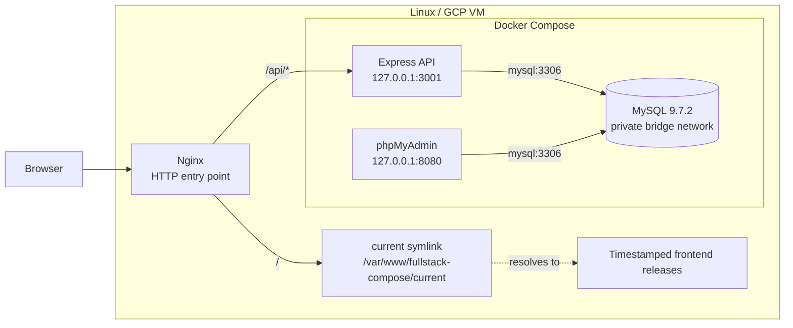
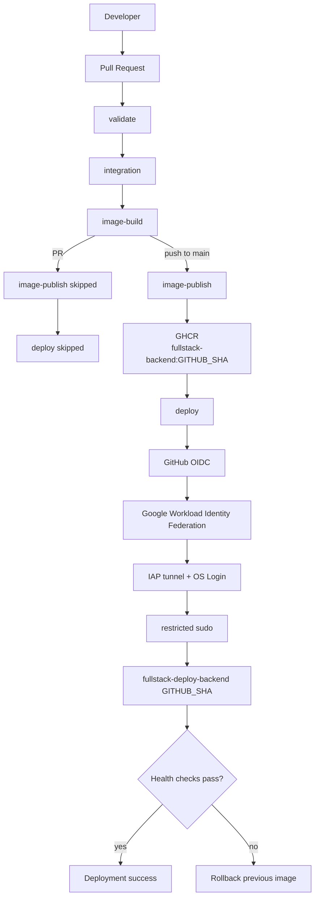
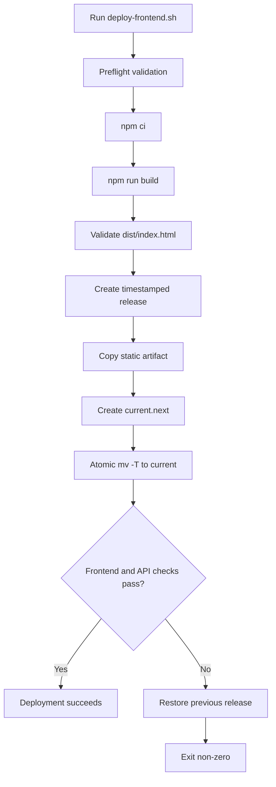

# Full-Stack DevOps Deployment Lab

[](https://github.com/DerbSwag/fullstack-docker-compose/actions/workflows/ci.yml)
[](https://docs.docker.com/compose/)
[](https://react.dev/)
[](https://expressjs.com/)
[](https://www.mysql.com/)
[](https://nginx.org/)
[](https://github.com/features/packages)
[](LICENSE)

A production-style DevOps portfolio lab built around a small React + Express + MySQL CRUD application. The application is intentionally simple so the repository can focus on delivery engineering: CI validation, integration testing, immutable container artifacts, secure GitHub-to-GCP authentication, least-privilege deployment, health validation, and rollback paths.

This repository is **not a claim of complete production readiness**. It demonstrates production-oriented controls that have been implemented and exercised in a lab environment, while documenting the remaining gaps explicitly.

## What This Lab Demonstrates

- Pull-request CI with Docker Compose validation, dependency installation, frontend lint/build, and backend syntax validation.
- Integration testing with a real MySQL container and the backend container running together.
- Runtime checks against backend `/health` and `/users` endpoints.
- Backend Docker image build validation before publication.
- Immutable backend image publication to GHCR using the exact Git commit SHA as the image tag.
- Automatic backend deployment after a successful push to `main`.
- GitHub Actions authentication to Google Cloud with OIDC + Workload Identity Federation instead of a long-lived service-account key.
- SSH transport through Google Cloud IAP with OS Login.
- A tested privilege boundary that denies direct Docker access, `sudo docker`, and `sudo` shell escalation to the deployment identity.
- Deployment through a restricted trusted entrypoint using an exact 40-character Git SHA.
- Production deployment serialization prevents overlapping backend deployments.
- The trusted backend deployment source includes a latest-`main` admission check so superseded SHAs can be skipped before production mutation.
- Backend health validation and automatic rollback to the previous image on deployment failure.
- Frontend static builds promoted through timestamped releases with atomic symlink activation and automatic rollback.
- Host-level Nginx serving the active frontend release and reverse-proxying `/api/` to the backend.

## System Architecture



| Component | Runtime | Responsibility |
| --- | --- | --- |
| React | Host filesystem under the active release | Browser UI |
| Nginx | Linux host | Static serving and API reverse proxy |
| Express | Docker Compose | CRUD API and database access |
| MySQL | Docker Compose | Persistent application data |
| phpMyAdmin | Docker Compose | Database administration |

MySQL is not published on a host port. Backend and phpMyAdmin are bound to host loopback rather than exposed directly on all interfaces.

## Delivery Architecture



The key invariant is that the image published by `image-publish` and the image requested by `deploy` use the **same immutable `GITHUB_SHA`**. The deployment path does not use a mutable `latest` tag.

## CI/CD Pipeline

The primary workflow is `.github/workflows/ci.yml`.

| Event | `validate` | `integration` | `image-build` | `image-publish` | `deploy` |
| --- | :---: | :---: | :---: | :---: | :---: |
| Pull request to `main` | ✅ | ✅ | ✅ | ⏭️ | ⏭️ |
| Push / merge to `main` | ✅ | ✅ | ✅ | ✅ | ✅ |

### `validate`

The validation job performs:

- `docker compose config`
- Node.js 22 setup
- `npm ci` for backend and frontend
- backend syntax validation with `node --check`
- frontend lint
- frontend production build
- validation that `frontend/dist/index.html` exists and is non-empty
- upload of the frontend build artifact

### `integration`

The integration job builds the backend image from the checked-out revision, starts MySQL and backend with Docker Compose, waits for the backend Docker healthcheck, then verifies:

```text
GET http://127.0.0.1:3001/health
GET http://127.0.0.1:3001/users
```

The temporary integration environment is removed with `docker compose down -v` after the job.

This is a real service-level integration check, but it is **not** a complete automated application test suite. The backend package test script remains a placeholder and there are no frontend component/E2E tests yet.

### `image-build`

After integration succeeds, GitHub Actions builds and inspects the backend Docker image. This keeps Dockerfile/build failures separate from publication and deployment.

### `image-publish`

Publication runs only for a push to `main`:

```text
ghcr.io/derbswag/fullstack-backend:<40-character-Git-SHA>
```

The job authenticates to GHCR with the workflow `GITHUB_TOKEN`, builds the image, and pushes the immutable SHA tag.

### `deploy`

The deploy job depends on `image-publish`, so deployment cannot begin unless publication succeeds.

The GitHub-hosted runner then:

1. Authenticates to Google Cloud through GitHub OIDC and Workload Identity Federation.
2. Configures `gcloud`.
3. Opens an SSH connection through IAP to the deployment VM.
4. Uses OS Login for the mapped deployment identity.
5. Executes only the restricted deployment entrypoint:

```bash
sudo -n /usr/local/sbin/fullstack-deploy-backend "$GITHUB_SHA"
```

The tested end-to-end deployment promoted the merge-commit SHA image, recreated only the backend service, reached Docker health `healthy`, and passed direct API plus Nginx-path health checks.

## Backend Deployment and Rollback

The production backend deployment entrypoint is maintained in the repository as `ops/fullstack-deploy-backend`. A reviewed copy is installed on the deployment host as the root-owned `/usr/local/sbin/fullstack-deploy-backend` and operates against the root-controlled deployment state under `/etc/fullstack-deploy`.

This keeps the version-controlled source reviewable without allowing the deployment identity to modify the privileged installed copy. The repository also retains `scripts/deploy-backend.sh` as the non-privileged repository deployment helper; it is not the production sudo entrypoint.

The trusted entrypoint accepts exactly one argument and validates it as a 40-character hexadecimal Git SHA:

```bash
sudo -n /usr/local/sbin/fullstack-deploy-backend <40-character-git-sha>
```

Deployment sequence:

```text
validate SHA
        ↓
resolve authoritative GitHub refs/heads/main
        ↓
requested SHA == latest main?
        ├── no  → skip stale deployment before production mutation
        └── yes → continue
        ↓
validate deployment prerequisites
        ↓
read currently running image
        ↓
pull GHCR target image:<SHA>
        ↓
validate Docker Compose configuration
        ↓
update BACKEND_IMAGE
        ↓
recreate backend only
        ↓
wait for Docker health
        ↓
check /health
        ↓
check /users
        ↓
check Nginx /api/health
        ↓
success
```

If the new backend fails to recreate cleanly, fails Docker health, or fails the post-deployment HTTP checks, the script restores the previous image and attempts to return the backend to a healthy state.

The backend deployment does **not** roll back MySQL writes or schema/data changes. Database recovery is a separate failure domain.

## Frontend Release Deployment

The production frontend path uses `npm run build`; it does not run the Vite development server in production.

`deploy-frontend.sh` creates timestamped releases under:

```text
/var/www/fullstack-compose/releases/YYYYMMDD-HHMMSS
```

Nginx serves through:

```text
/var/www/fullstack-compose/current
```

Deployment flow:



The release boundary is intentionally explicit:

- Build output is prepared before activation.
- A complete release directory exists before Nginx serves it.
- Activation is an atomic symlink replacement.
- The previous release remains available as a recovery target.
- Cleanup is not mixed into the deployment transaction.

After activation the script checks the frontend and API path. If validation fails, the previous release pointer is restored and the deployment exits non-zero.

## Security Model

The lab uses several layered controls rather than treating SSH access as unrestricted deployment authority.

### GitHub to Google Cloud

- GitHub Actions requests a short-lived OIDC token.
- Google Cloud Workload Identity Federation exchanges that identity for Google credentials.
- No long-lived GCP service-account JSON key is required by the workflow.
- The deployment connection uses IAP tunneling and OS Login.

### Privilege boundary

The manually-triggered `.github/workflows/cd-auth-test.yml` verifies that the deployment identity is intentionally constrained:

```text
direct Docker socket access     DENIED
sudo docker                     DENIED
sudo shell                      DENIED
trusted deploy command          ALLOWED
```

The authorization test also checks that Docker is actually present before accepting a Docker failure as evidence of permission denial, avoiding a false-positive security test caused by a missing daemon/socket.

### Artifact integrity and deployment scope

- Backend production images use immutable Git SHA tags.
- The workflow never deploys `latest`.
- `deploy` depends on successful `image-publish`.
- Publish and deploy are restricted to pushes to `main`.
- Pull requests can validate and build but cannot publish or deploy through the primary workflow.
- The deployment identity is not expected to manage Docker directly; privileged operations are encapsulated in the trusted deployment entrypoint.
- `.env` is excluded from Git and `.env.example` contains placeholders only.
- MySQL is private to the Compose network.

## Failure Boundaries

Recovery is deliberately scoped rather than presented as universal rollback.

| Failure domain | Current recovery behavior |
| --- | --- |
| Frontend static release | Restore previous release symlink |
| Backend container image | Restore previous backend image and re-check health |
| MySQL application data | Not automatically rolled back |
| Host Nginx configuration | Not automatically rolled back |
| Host packages / OS state | Not automatically rolled back |
| GCP / IAM configuration | Managed outside application rollback |

This distinction matters: application deployment rollback is not the same as database disaster recovery or host recovery.

## Services and API

### Express

The backend listens on port `3001` and is published on `127.0.0.1:3001`.

| Method | Route | Purpose |
| --- | --- | --- |
| `GET` | `/health` | Query MySQL and report dependency status |
| `GET` | `/users` | List users |
| `POST` | `/users` | Create a user |
| `PUT` | `/users/:id` | Update a user |
| `DELETE` | `/users/:id` | Delete a user |

Through Nginx:

```bash
curl http://127.0.0.1/api/health
curl http://127.0.0.1/api/users
```

The API uses a MySQL pool, parameterized SQL queries, JSON request parsing, and validation for required `name` and `email` values.

### MySQL

MySQL uses `mysql:9.7.2`. On first initialization, `mysql/init.sql` creates the `users` table, applies a unique email constraint, and inserts sample records.

```text
fullstack_mysql_data -> /var/lib/mysql
```

`docker compose down` preserves the named volume. `docker compose down -v` removes it and deletes persisted project data.

### phpMyAdmin

phpMyAdmin uses `PMA_HOST=mysql` and `PMA_PORT=3306`. It is published only on `127.0.0.1:8080` and should remain restricted to administrative access.

## Repository Structure

```text
.
|-- .github/
|   `-- workflows/
|       |-- ci.yml                    # PR CI, integration, image publish, auto-CD
|       `-- cd-auth-test.yml          # WIF/IAP and privilege-boundary validation
|-- backend/
|   |-- Dockerfile
|   |-- index.js
|   |-- package.json
|   |-- package-lock.json
|   `-- src/
|       |-- app.js
|       |-- db.js
|       |-- http.js
|       `-- routes/users.js
|-- frontend/
|   |-- Dockerfile                    # retained image definition; not production path
|   |-- index.html
|   |-- package.json
|   |-- package-lock.json
|   |-- vite.config.js
|   `-- src/
|-- mysql/
|   `-- init.sql
|-- ops/
|   `-- fullstack-deploy-backend       # source for the trusted production deploy entrypoint
|-- scripts/
|   |-- deploy-backend.sh              # repository-level backend deployment helper
|   `-- deploy-frontend.sh             # atomic static release + rollback logic
|-- docker-compose.yml
|-- .env.example
|-- LICENSE
`-- README.md
```

## Configuration

Create the local environment file from the example:

```bash
cp .env.example .env
```

| Variable | Purpose |
| --- | --- |
| `MYSQL_ROOT_PASSWORD` | MySQL root credential |
| `MYSQL_DATABASE` | Application database name |
| `MYSQL_USER` | Application database user |
| `MYSQL_PASSWORD` | Application database password |
| `BACKEND_IMAGE` | Backend image selected by Compose/deployment logic |

Use real non-placeholder values outside source control.

## Local Development

### Frontend

```bash
cd frontend
npm ci
npm run dev
npm run lint
npm run build
```

### Backend

```bash
cd backend
npm ci
npm start
```

The backend expects its port and database connection environment variables to be available.

### Compose

```bash
cp .env.example .env
docker compose config
docker compose up -d --build
docker compose ps
```

## Host Operations

### Nginx baseline

The host Nginx configuration is external to this repository. The deployment model expects the equivalent of:

```nginx
root /var/www/fullstack-compose/current;

location / {
    try_files $uri $uri/ /index.html;
}

location /api/ {
    proxy_pass http://127.0.0.1:3001/;
}
```

Validate and reload host Nginx after configuration changes:

```bash
sudo nginx -t
sudo systemctl reload nginx
```

### Verify runtime

```bash
readlink -f /var/www/fullstack-compose/current
test -s /var/www/fullstack-compose/current/index.html
curl -fsS http://127.0.0.1/
curl -fsS http://127.0.0.1/api/health
curl -fsS http://127.0.0.1/api/users
docker compose ps
```

### Inspect logs

```bash
docker compose logs --tail=100 backend mysql phpmyadmin
```

## Verified Lab Behavior

The following behaviors have been exercised rather than only documented as design goals:

- A pull request ran `validate`, `integration`, and `image-build` successfully while `image-publish` and `deploy` were skipped.
- After merge to `main`, all five primary pipeline jobs completed successfully.
- The backend image was published under the merge commit SHA.
- Auto-CD authenticated successfully through OIDC/WIF.
- The runner established the deployment connection through IAP/OS Login.
- The target host pulled the exact SHA-tagged GHCR image requested by the workflow.
- The backend service was recreated and reached Docker health `healthy`.
- Direct backend health, `/users`, and the Nginx `/api/health` path all passed after deployment.
- The final running backend image matched the merge commit SHA requested by Auto-CD.
- The privilege-boundary workflow confirmed that direct Docker, `sudo docker`, and `sudo` shell access were denied while the trusted deployment command was permitted.
- Frontend controlled-failure testing exercised automatic restoration of the previous release pointer.

## Current Limitations

This lab intentionally does **not** describe itself as a fully hardened Internet-facing production service. Current gaps include:

- no TLS configuration stored in this repository
- no application authentication or authorization
- broad CORS policy
- no rate limiting
- phpMyAdmin still uses a mutable `latest` image tag
- no external managed secret manager
- no centralized metrics/logging/alerting stack in this repository
- no automated database backup/restore pipeline
- no full backend unit/integration test suite beyond the service-level CI checks
- no frontend component or end-to-end test suite
- no multi-run cancellation; production backend deployments are serialized rather than interrupted in progress
- no image vulnerability scan, SBOM, or signing/attestation stage yet
- no canary or multi-instance traffic-shifting strategy

## Roadmap

Next improvements are intentionally separated from completed capabilities:

1. Complete controlled production verification of latest-`main` stale-deployment protection.
2. Move workflow permissions toward tighter per-job least privilege where practical.
3. Add backend automated tests and frontend component/E2E tests.
4. Add container vulnerability scanning and generate an SBOM.
5. Pin mutable third-party image tags to reviewed versions/digests.
6. Add managed secret storage and document credential rotation.
7. Add TLS and hardened Internet-facing ingress controls if the lab is exposed publicly.
8. Add metrics, logs, deployment observability, and alerting.
9. Automate database backup plus restore verification drills.
10. Evaluate blue-green or canary backend deployment only after a multi-instance architecture exists.

## Portfolio Highlights

The strongest signals in this repository are operational rather than CRUD complexity:

- **CI discipline:** pull requests must pass validation, integration, and image-build stages before merge.
- **Artifact traceability:** production backend artifacts are identified by the exact Git SHA.
- **Environment gating:** pull requests cannot publish or deploy through the main pipeline.
- **Short-lived cloud authentication:** GitHub OIDC + Google Workload Identity Federation removes the need for a long-lived GCP key in the workflow.
- **Least privilege:** the deployment identity is denied general Docker and shell escalation and is routed through a narrow trusted deploy command.
- **Health-aware delivery:** deployment success requires container health plus direct and reverse-proxy HTTP checks.
- **Rollback design:** frontend and backend each have explicit recovery paths with documented failure boundaries.
- **Operational clarity:** immutable backend releases and timestamped frontend releases make the running version auditable.

## Interview Talking Points

### Why use Git SHA image tags instead of `latest`?

A Git SHA creates a direct relationship between source revision, published image, and deployed artifact. It also makes rollback and incident analysis more deterministic because the tag is immutable by convention in this workflow.

### Why OIDC / Workload Identity Federation?

The workflow can obtain short-lived Google credentials from GitHub's workload identity instead of storing a long-lived service-account JSON key in GitHub Secrets. This reduces secret-management and credential-rotation exposure.

### Why not give the deploy identity Docker access?

Direct Docker access is effectively highly privileged on a Docker host. The lab instead validates that direct Docker and broad sudo access are denied, then permits only a reviewed deployment entrypoint with a strict SHA argument.

### Is the frontend deployment blue-green?

No. It uses blue-green-like pointer switching, but there are not two independently live traffic environments. The accurate description is **atomic release deployment with automatic rollback**.

### Is the backend deployment blue-green?

No. The current backend deployment recreates the single backend service with the selected immutable image. A true blue-green or canary strategy would require multiple concurrently available backend instances and controlled traffic switching.

### Does rollback restore database state?

No. Backend and frontend rollback restore application/runtime versions only. MySQL data recovery is intentionally treated as a separate operational concern.

## License

Licensed under the [Apache License 2.0](LICENSE).
