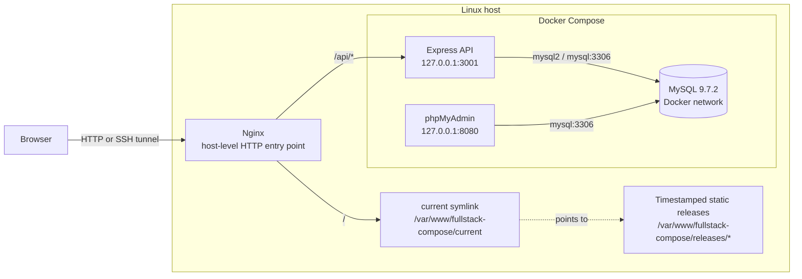
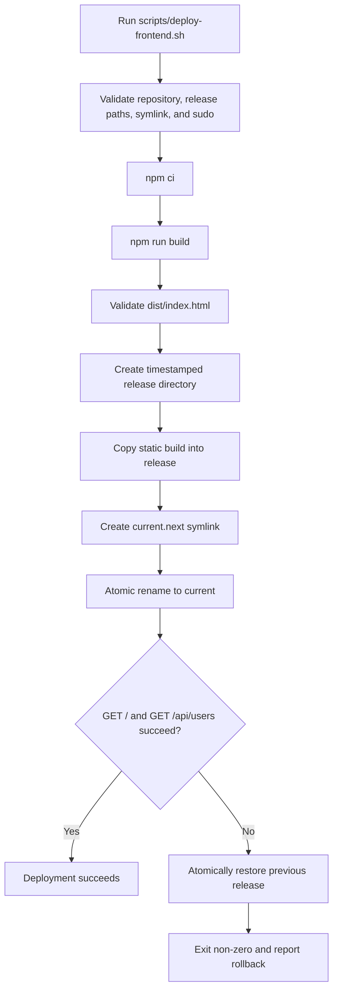

# Full-Stack Docker Compose Deployment

[](https://docs.docker.com/compose/)
[](https://react.dev/)
[](https://expressjs.com/)
[](https://www.mysql.com/)
[](https://nginx.org/)
[](LICENSE)

A small full-stack CRUD application used to demonstrate a release-oriented deployment model on a Linux host. The React application is compiled into static assets, promoted through timestamped releases, and served by host-level Nginx. Express, MySQL, and phpMyAdmin run as Docker Compose services.

The repository contains a working deployment script with preflight validation, atomic symlink activation, post-deploy health checks, and automatic rollback. It does not contain CI/CD configuration, automated application tests, TLS configuration, authentication, or production secret management.

## Overview

The application provides user CRUD operations through a React UI and an Express API. The normal HTTP entry point is Nginx:

- `/` serves the active React release from `/var/www/fullstack-compose/current`.
- `/api/*` is proxied to the Express container on `127.0.0.1:3001`.
- The API connects to MySQL over the private Docker bridge network using the service name `mysql`.
- phpMyAdmin is exposed on host loopback at `127.0.0.1:8080` for administrative access.
- Frontend deployment is independent of the Compose lifecycle; backend, database, and phpMyAdmin remain Compose-managed services.

## Architecture



The frontend uses relative API paths such as `/api/users`, so browser requests stay on the Nginx origin. The repository does not contain the host Nginx site file; Nginx must be configured to serve `current` and proxy `/api/` to the backend loopback port.

## Deployment Flow



## Release Strategy

The deployment script builds the frontend from the checked-out repository and publishes only the generated `frontend/dist` contents. Each release is stored under:

```text
/var/www/fullstack-compose/releases/YYYYMMDD-HHMMSS
```

The active release is selected through:

```text
/var/www/fullstack-compose/current -> /var/www/fullstack-compose/releases/YYYYMMDD-HHMMSS
```

Before activation, the script verifies the repository, package manifests, deployment directories, current symlink, previous release, and passwordless `sudo`. It also validates that both the new and previous releases contain a non-empty `index.html`.

Activation is atomic: the script creates `current.next` and replaces `current` with `mv -T`. Nginx therefore reads from one complete release at a time; it never needs to serve a partially copied directory.

The frontend release process does not rebuild or recreate the backend, MySQL, or phpMyAdmin services.

## Rollback Strategy

Rollback is automatic when either post-deploy request fails:

```bash
curl -fsS -o /dev/null http://127.0.0.1/
curl -fsS -o /dev/null http://127.0.0.1/api/users
```

The script retains the previous `current` target, switches to the new release, runs both checks, and atomically restores the previous target when validation fails. It then exits non-zero so an operator or external job can treat the deployment as failed even though service traffic has been returned to the previous frontend release.

This is a release-pointer rollback, not a database rollback. MySQL data is persisted in the `fullstack_mysql_data` named volume and is not changed by the frontend deployment script.

## Repository Structure

```text
.
├── backend/
│   ├── Dockerfile
│   ├── index.js
│   ├── package.json
│   └── package-lock.json
├── frontend/
│   ├── Dockerfile
│   ├── index.html
│   ├── package.json
│   ├── package-lock.json
│   ├── vite.config.js
│   └── src/
├── mysql/
│   └── init.sql
├── scripts/
│   └── deploy-frontend.sh
├── docker-compose.yml
├── .env.example
├── LICENSE
└── README.md
```

The backend entry point is `backend/index.js`. Runtime composition is split into `backend/src/app.js`, `backend/src/db.js`, `backend/src/http.js`, and `backend/src/routes/users.js`. The frontend interaction layer is split between `frontend/src/api/users.js`, `frontend/src/components/UserForm.jsx`, and `frontend/src/components/UserList.jsx`.

`frontend/vite.config.js` defines the build tool and local development server settings. The production deployment path uses `npm run build` and serves the resulting static output through Nginx; it does not use the Vite development server.

## Services and API

| Component | Runtime location | Responsibility |
| --- | --- | --- |
| React | Host filesystem under the active release | Browser UI and relative `/api` requests |
| Nginx | Linux host | Static file serving and `/api/` reverse proxy |
| Express 5 | Docker Compose, host loopback `3001` | REST API and database access |
| MySQL 9.7.2 | Docker Compose, private bridge network | Persistent application data |
| phpMyAdmin | Docker Compose, host loopback `8080` | Database administration |

The backend exposes these routes:

| Method | Route | Purpose |
| --- | --- | --- |
| `GET` | `/health` | Query MySQL and report API/database status |
| `GET` | `/users` | List users |
| `POST` | `/users` | Create a user |
| `PUT` | `/users/:id` | Update a user |
| `DELETE` | `/users/:id` | Delete a user |

Through Nginx, the same routes are available under `/api`, for example:

```bash
curl http://127.0.0.1/api/health
curl http://127.0.0.1/api/users
```

## Security

The repository includes these baseline controls:

- Runtime database credentials are supplied through `.env`; `.env.example` contains placeholders and `.env` is ignored by Git.
- Backend and phpMyAdmin are configured to bind to host loopback rather than all host interfaces.
- MySQL is not published to the host; application services reach it through the Docker network.
- The API uses parameterized `mysql2` queries for user-supplied values.
- SSH local port forwarding can provide remote access without directly publishing service ports.
- The deployment script validates that `current` resolves inside the configured `releases` directory before switching it.

These are implementation details, not a claim of complete Internet-facing hardening. The repository does not implement authentication, authorization, TLS, rate limiting, centralized secrets management, or a backup/restore workflow. phpMyAdmin should remain restricted to an administrative access path.

## Operations

### Start the application services

```bash
cp .env.example .env
# Edit .env with non-placeholder credentials.
docker compose up -d --build
docker compose ps
```

The Compose health check waits for MySQL to answer `mysqladmin ping` before starting the backend and phpMyAdmin. The backend also exposes a container healthcheck against `/health`. MySQL data is stored in the named volume `fullstack_mysql_data`.

### Configure Nginx

The host Nginx site should serve the active release and proxy API requests. A minimal location layout is:

```nginx
root /var/www/fullstack-compose/current;

location / {
    try_files $uri $uri/ /index.html;
}

location /api/ {
    proxy_pass http://127.0.0.1:3001/;
}
```

Validate and reload only after the site file has been installed by the operator:

```bash
sudo nginx -t
sudo systemctl reload nginx
```

### Deploy a frontend release

The script expects the checkout at `$HOME/fullstack-compose` and the release directories to already exist:

```bash
sudo mkdir -p /var/www/fullstack-compose/releases
sudo ln -s /var/www/fullstack-compose/releases/INITIAL_RELEASE /var/www/fullstack-compose/current
```

The initial release must contain a valid, non-empty `index.html`. After that bootstrap step, run:

```bash
bash scripts/deploy-frontend.sh
```

The script requires passwordless `sudo`, `npm`, `curl`, and standard Linux symlink/rename utilities. It performs the build, release copy, atomic activation, health checks, and automatic rollback described above.

## Runbook

### Verify the active release

```bash
readlink -f /var/www/fullstack-compose/current
test -s /var/www/fullstack-compose/current/index.html
curl -fsS http://127.0.0.1/
curl -fsS http://127.0.0.1/api/health
```

### Inspect service state and logs

```bash
docker compose ps
docker compose logs -f backend
docker compose logs -f mysql
docker compose logs -f phpmyadmin
```

### Perform a controlled rollback test

Use a maintenance window or an isolated test host. First record the active release, then stop the backend container and run the frontend deployment script:

```bash
readlink -f /var/www/fullstack-compose/current
docker compose stop backend
bash scripts/deploy-frontend.sh
```

The API health request should fail, the script should restore the previous release, and the command should exit non-zero. Confirm the pointer and then restore the backend:

```bash
readlink -f /var/www/fullstack-compose/current
docker compose start backend
curl -fsS http://127.0.0.1/api/health
```

This exercises the rollback branch in the checked-in deployment script. It is a controlled operational test, not an automated test suite.

### Preserve or remove database data

Keep the named volume when recreating containers:

```bash
docker compose down
docker compose up -d
```

Do not use `docker compose down -v` unless deleting the Compose-managed MySQL data is intentional.

### Remote access through SSH

For a host where services are bound to loopback, forward the Nginx entry point to a local workstation:

```bash
ssh -N -L 8081:127.0.0.1:80 user@server
```

Then use `http://127.0.0.1:8081`. phpMyAdmin can be forwarded separately when required:

```bash
ssh -N -L 8080:127.0.0.1:8080 user@server
```

## Development

### Backend

```bash
cd backend
npm ci
npm start
```

The backend expects `PORT`, `DB_HOST`, `DB_PORT`, `DB_NAME`, `DB_USER`, and `DB_PASSWORD`. In the Compose runtime, `DB_HOST` is `mysql`.

### Frontend

```bash
cd frontend
npm ci
npm run dev
```

Use `npm run build` to produce the static production artifact in `frontend/dist` and `npm run lint` for the configured Oxlint check. Local development may use Vite; the deployed architecture serves only the compiled static output through Nginx.

### Compose validation

```bash
docker compose config
docker compose up -d --build
curl http://127.0.0.1:3001/health
```

The repository does not currently provide a test suite. The backend package's `test` script is a placeholder that exits with an error.

## Future Roadmap

The following items are intentionally not represented as current capabilities:

- CI/CD automation for build, deployment, and rollback orchestration.
- Automated backend and frontend test coverage.
- Authentication, authorization, stronger request validation, and rate limiting.
- TLS and a managed production secret store.
- Structured logging, metrics, alerting, and deployment observability.
- Database backup, restore, and recovery validation.
- Release retention and cleanup automation.

## Portfolio Highlights

This repository demonstrates practical DevOps design decisions that are visible in the implementation:

- Separating immutable frontend build artifacts from long-running backend services.
- Using host-level Nginx as the single HTTP entry point for static assets and API routing.
- Keeping MySQL private to the Docker network while persisting data in a named volume.
- Using health-aware Compose dependencies for database-backed services.
- Promoting releases with an atomic symlink switch instead of copying over live files.
- Validating both the frontend and API after activation.
- Automatically restoring the previous frontend release when post-deploy checks fail.
- Including a repeatable, controlled procedure for exercising the rollback path.

The project is a focused deployment lab and portfolio artifact. Its operational mechanisms are implemented in the repository, while the roadmap above identifies the controls that would still be required for a broader production service.

## License

This project is licensed under the [Apache License 2.0](LICENSE).
## Operational Model
The repository has two related but separate lifecycles.
The application service lifecycle is managed by Docker Compose.
The frontend artifact lifecycle is managed by `scripts/deploy-frontend.sh`.
This separation is deliberate.
The backend process is long-running.
The MySQL process is stateful.
phpMyAdmin is an administrative utility.
The React frontend is a collection of versioned files.
These components do not need the same deployment mechanism.
### Application service lifecycle
Compose creates the MySQL container.
Compose creates the backend container.
Compose creates the phpMyAdmin container.
Compose attaches the services to `fullstack-network`.
Compose creates or reuses `fullstack_mysql_data`.
MySQL runs its configured health check.
The backend waits for the MySQL health condition.
phpMyAdmin also waits for the MySQL health condition.
The services restart according to `restart: unless-stopped`.
### Frontend artifact lifecycle
The operator checks out a Git revision.
The deployment script runs `npm ci`.
The deployment script runs `npm run build`.
Vite writes the build to `frontend/dist`.
The script checks for a non-empty `dist/index.html`.
The script creates a timestamped release directory.
The script copies the static artifact into that directory.
The script creates `current.next`.
The script atomically replaces `current`.
Nginx follows `current` for new requests.
The script checks the frontend and API paths.
The script either reports success or restores the previous pointer.
## Component Responsibilities
### Browser
The browser requests the Nginx origin.
The browser loads the React entry document.
The browser loads static JavaScript and CSS assets.
The browser sends API requests using relative paths.
The browser does not need to know the backend container address.
The browser does not connect directly to MySQL.
The browser does not connect directly to the Docker network.
### Nginx
Nginx is installed on the host.
Nginx is outside the Compose service graph.
Nginx serves files from the active release.
Nginx routes `/api/` to the backend loopback port.
Nginx provides the single application HTTP entry point.
Nginx is not built or reloaded by the deployment script.
The operator owns the Nginx site configuration.
The repository documents the required routing shape.
The repository does not include a host-specific Nginx file.
### React frontend
React renders the user interface.
The frontend uses JavaScript modules.
Vite bundles the source files.
The build output is static.
The production path has no frontend application process.
The production path has no frontend container in Compose.
The static files are immutable after release creation.
New code produces a new release directory.
The active symlink identifies the served version.
### Express backend
Express listens on port `3001`.
The container listens on `0.0.0.0` internally.
The host publishes the service on `127.0.0.1:3001`.
The API parses JSON request bodies.
The API exposes CRUD routes for users.
The API exposes a database-backed health endpoint.
The API uses a MySQL connection pool.
The API uses `mysql2/promise`.
The API uses parameterized SQL values.
The API returns JSON responses.
The backend is not horizontally scaled by the repository.
The backend has no authentication middleware in the repository.
### MySQL
MySQL uses the `mysql:9.7.2` image.
MySQL receives credentials from Compose environment interpolation.
MySQL receives the initialization script on first data-directory initialization.
MySQL stores data under `/var/lib/mysql` in the container.
The named volume backs that path.
MySQL is reachable by service name inside the Docker network.
MySQL is not published on a host port.
The health check runs `mysqladmin ping`.
The health check has a 30-second start period.
The health check retries ten times.
### phpMyAdmin
phpMyAdmin uses the `phpmyadmin:latest` image.
phpMyAdmin resolves MySQL through `PMA_HOST=mysql`.
phpMyAdmin uses port `3306` for the database connection.
phpMyAdmin is published on `127.0.0.1:8080`.
phpMyAdmin is not the application data path.
phpMyAdmin is an operator-facing administration path.
Access should be restricted to trusted administrative users.
## Request Flows
### Static page request
The client requests `/`.
Nginx receives the request on the host.
Nginx resolves the configured document root.
The document root is the `current` symlink.
The symlink resolves to one release directory.
Nginx reads `index.html` from that release.
The response returns to the client.
The client then requests the referenced assets.
Those assets are read from the same release.
### API request
The client requests `/api/users`.
Nginx matches the `/api/` location.
Nginx proxies to `127.0.0.1:3001`.
The host forwards the request to the backend container.
Express handles `/users` after the configured proxy path mapping.
The backend queries MySQL using the `mysql` service name.
MySQL returns the query result.
Express serializes the response as JSON.
Nginx returns the API response to the client.
### Health request
The client can request `/api/health` through Nginx.
Nginx forwards the request to Express.
Express runs `SELECT 1` against the pool.
The API returns `status: ok` when the query succeeds.
The API returns HTTP 500 when the database query fails.
The deployment script uses `/api/users` as its API availability check.
The `/health` endpoint remains available for operator diagnosis.
## Compose Design Details
### Network boundary
The services join `fullstack-network`.
The network uses the Docker bridge driver.
Container-to-container traffic uses service discovery.
The backend uses `mysql` rather than `localhost`.
phpMyAdmin uses `mysql` rather than a host address.
The browser never joins this network.
The host only exposes selected loopback ports.
### Dependency ordering
Compose starts the database service.
MySQL initializes or opens its data directory.
The health check begins after the start period.
Compose waits for `service_healthy`.
The backend can then start.
phpMyAdmin can then start.
This is stronger than relying only on container creation order.
The health condition does not replace application monitoring.
The health condition does not validate frontend assets.
The deployment script validates frontend availability separately.
### Persistence boundary
Container recreation does not inherently delete the named volume.
`docker compose down` leaves the named volume in place.
`docker compose down -v` removes the volume for this project.
Removing the volume removes the persisted MySQL data.
The frontend releases do not contain database data.
The frontend rollback does not reverse database writes.
Database recovery requires a separate operational procedure.
### Image boundary
The backend image is built from `backend/Dockerfile`.
The backend image is tagged `fullstack-backend:0.1` in Compose.
MySQL is pulled from the configured MySQL image.
phpMyAdmin is pulled from the configured phpMyAdmin image.
The frontend Dockerfile is not used by the current production release path.
The current production path builds the frontend on the deployment host.
This distinction should be preserved in future changes.
## Environment Contract
The repository includes `.env.example`.
The real `.env` file is ignored by Git.
`MYSQL_ROOT_PASSWORD` supplies the MySQL root password.
`MYSQL_DATABASE` names the application database.
`MYSQL_USER` supplies the application database user.
`MYSQL_PASSWORD` supplies the application database password.
Compose interpolates these values into the MySQL service.
Compose interpolates the database name into the backend service.
Compose interpolates the application user into the backend service.
Compose interpolates the application password into the backend service.
The backend sets `DB_HOST=mysql` in Compose.
The backend sets `DB_PORT=3306` in Compose.
The backend sets `PORT=3001` in Compose.
No production secret manager is configured.
No secret value should be committed to the repository.
## Deployment Preconditions
The checkout must exist at `$HOME/fullstack-compose`.
The `frontend` directory must exist.
The frontend package manifest must exist.
The frontend lockfile must exist.
The deployment root must exist.
The releases directory must exist.
The `current` path must be a symbolic link.
The current target must be inside the releases directory.
The current target must contain `index.html`.
Passwordless `sudo` must be available.
`npm` must be available on the host.
`curl` must be available on the host.
The Nginx site must already be configured.
The backend must be reachable through the configured Nginx route.
The initial release must be bootstrapped manually.
The script intentionally fails early when these conditions are absent.
## Deployment Command Reference
Change to the expected checkout:
```bash
cd "$HOME/fullstack-compose"
```
Inspect the current release:
```bash
readlink -f /var/www/fullstack-compose/current
```
Inspect available releases:
```bash
ls -1 /var/www/fullstack-compose/releases
```
Run the deployment:
```bash
bash scripts/deploy-frontend.sh
```
The script is executable in Git.
It can also be invoked directly:
```bash
./scripts/deploy-frontend.sh
```
The script uses `set -Eeuo pipefail`.
Unset variables cause the script to fail.
Pipeline failures are not silently ignored.
The helper `fail()` writes errors to stderr.
The script exits non-zero after a failed deployment.
## Release Directory Operations
The deployment root is `/var/www/fullstack-compose`.
The release root is `/var/www/fullstack-compose/releases`.
The active pointer is `/var/www/fullstack-compose/current`.
The temporary activation pointer is `current.next`.
The temporary rollback pointer is `current.rollback`.
Temporary links must not already exist.
The script rejects an invalid release identifier.
The release identifier uses `YYYYMMDD-HHMMSS`.
The script rejects a collision with an existing release.
The script creates the release directory with `sudo mkdir`.
The script copies build output with `sudo cp -a`.
The script validates the copied entry document.
The script does not delete old releases.
The script does not run `docker prune`.
The script does not run `rm -rf`.
Release cleanup is intentionally outside the deployment transaction.
## Atomic Switch Semantics
The previous target is resolved before activation.
The previous target must be a timestamped release.
The previous target must contain `index.html`.
The new release is copied before any pointer changes.
The new release is validated before any pointer changes.
The script creates a symlink to the new release.
The symlink is named `current.next`.
The script moves `current.next` over `current`.
The move uses `mv -T`.
The script resolves `current` after the move.
The resolved path must equal the new release.
If it does not, the script fails.
Nginx continues to use the stable `current` path.
The deployment does not copy files into `current` directly.
The deployment does not expose an incomplete release through `current`.
The filesystem and Nginx configuration still require normal host permissions.
## Failure Modes and Responses
### Missing repository
The script reports that the repo root was not found.
No release is created.
No symlink is changed.
The operator should correct the checkout path.
### Missing package lockfile
The script fails before `npm ci`.
The operator should restore the expected frontend files.
No release is activated.
### Build failure
`npm ci` or `npm run build` returns non-zero.
The script exits because of `set -e`.
The existing `current` pointer remains unchanged.
The operator should inspect the build output and dependency state.
### Missing build output
The script checks for `frontend/dist`.
The script checks for `frontend/dist/index.html`.
The script checks that the file is non-empty.
The script exits when any check fails.
The existing release remains active.
### Invalid current pointer
The script requires `current` to be a symlink.
The script resolves the link.
The target must be under `releases`.
The script rejects targets outside that directory.
This protects the switch operation from an unexpected target.
### Health check failure
The new release may already be active when checks run.
The script checks the frontend root.
The script checks `/api/users`.
If either check fails, the old target is selected.
The rollback pointer is created.
The rollback pointer replaces `current` atomically.
The script verifies the restored target.
The script exits non-zero after rollback.
The operator should investigate the failed release before retrying.
### Temporary link collision
The script rejects an existing `current.next`.
The script rejects an existing `current.rollback`.
The operator should inspect the links before removing anything.
The deployment script does not remove them automatically.
This prevents an unexpected overwrite of an operator-owned path.
## Controlled Rollback Test Evidence
The rollback branch can be tested without changing application source.
The test uses a controlled backend outage.
The backend is stopped before a deployment attempt.
The frontend build can still complete.
The new static release can still be prepared.
The frontend root may still respond successfully.
The API request should fail because the backend is stopped.
The combined health condition is therefore false.
The script switches `current` back to the previous release.
The script exits with a failure status.
The backend is started again after verification.
The API health endpoint should then recover.
The test validates release-pointer recovery.
The test does not validate database restore.
The test does not validate Nginx configuration changes.
The test does not constitute automated CI coverage.
The procedure belongs in a maintenance window or isolated host.
## Post-Deployment Verification
Check the active symlink.
```bash
readlink -f /var/www/fullstack-compose/current
```
Check the entry document.
```bash
test -s /var/www/fullstack-compose/current/index.html
```
Check the frontend through Nginx.
```bash
curl -fsS -o /dev/null -w '%{http_code}\n' http://127.0.0.1/
```
Check the API through Nginx.
```bash
curl -fsS -o /dev/null -w '%{http_code}\n' http://127.0.0.1/api/users
```
Check API and database health.
```bash
curl -fsS http://127.0.0.1/api/health
```
Check Compose state.
```bash
docker compose ps
```
Check the active Nginx configuration.
```bash
sudo nginx -t
```
Check recent service logs when needed.
```bash
docker compose logs --tail=100 backend mysql phpmyadmin
```
## Troubleshooting Matrix
| Symptom | Likely boundary | First check |
| --- | --- | --- |
| Nginx returns 404 for `/` | Static release or Nginx root | `readlink -f current` and `test -s current/index.html` |
| Nginx returns 502 for `/api` | Backend process or proxy target | `docker compose ps` and backend logs |
| API reports database disconnected | MySQL readiness or credentials | `docker compose ps` and `curl /api/health` |
| Deployment stops before build | Preflight failure | Read the first `ERROR:` line |
| Deployment build fails | Frontend dependencies or source | Run `npm ci` and `npm run build` in `frontend` |
| Deployment rolls back | Post-deploy frontend/API check | Check Nginx, backend, and current pointer |
| phpMyAdmin cannot connect | MySQL service or Compose network | Verify `mysql` health and Compose logs |
| Data disappears after restart | Volume lifecycle | Check whether `down -v` was used |
| SSH tunnel shows no page | Host port or Nginx listener | Confirm tunnel target and `curl` on the host |
## Safe Operator Practices
Read the current release before a deployment.
Keep at least one known-good release available.
Do not remove the active release.
Do not point `current` outside `releases`.
Do not manually copy new files into `current`.
Do not delete the MySQL volume during routine recreation.
Do not expose MySQL publicly for convenience.
Do not expose phpMyAdmin publicly without an explicit security design.
Do not put credentials in shell history when avoidable.
Use a controlled test host for rollback experiments.
Record the release identifier during incident response.
Capture command output when reporting a failed deployment.
Inspect before removing stale temporary links.
Treat a non-zero deployment exit as an operational signal.
Verify both frontend and API paths after recovery.
## What the Repository Does Not Automate
It does not provision the Linux host.
It does not install Nginx.
It does not install Docker.
It does not install Node.js or npm.
It does not create the initial release automatically.
It does not create a systemd unit for the deployment script.
It does not configure a firewall.
It does not configure DNS.
It does not request certificates.
It does not renew certificates.
It does not configure an external load balancer.
It does not run a CI pipeline.
It does not run an automated rollback test.
It does not clean old releases.
It does not back up MySQL.
It does not restore MySQL.
It does not rotate secrets.
It does not create users or roles in an identity provider.
These omissions are boundaries of the current repository.
## Review Checklist for Changes
Confirm that frontend API paths remain relative.
Confirm that the build still produces `dist/index.html`.
Confirm that Nginx still serves `current`.
Confirm that `/api/` still reaches Express.
Confirm that Express still resolves `mysql` in Compose.
Confirm that the MySQL volume remains named and persistent.
Confirm that Compose health conditions remain intact.
Confirm that the deployment script remains executable.
Run `bash -n scripts/deploy-frontend.sh` after shell changes.
Run `docker compose config` after Compose changes.
Run `npm run build` after frontend changes.
Run `npm run lint` after frontend changes.
Check `curl /` after Nginx changes.
Check `curl /api/health` after backend or database changes.
Perform the controlled rollback procedure after rollback changes.
Review the Git diff before committing.
Do not document capabilities that are not present.
## Interview Discussion Points
### Why static frontend deployment?
The frontend output is static after compilation.
Serving static files removes an unnecessary production process.
It also makes the deployed artifact easy to identify.
The artifact can be copied into a release directory.
The release can be selected with a symlink.
The backend lifecycle remains independent.
### Why use a symlink?
The symlink gives Nginx a stable path.
The target identifies the active version.
Activation changes one pointer.
The release contents are prepared before activation.
Rollback changes the pointer back.
The design avoids copying over live files.
### What does atomic mean here?
The release directory is assembled before exposure.
The `current.next` link is prepared separately.
`mv -T` replaces the active link in one filesystem operation.
The deployment does not gradually update `current` contents.
The guarantee is scoped to the host filesystem and operation.
It is not a claim of global multi-host atomicity.
### What is actually health-checked?
Compose checks that MySQL responds to `mysqladmin ping`.
The API exposes a query-backed `/health` endpoint.
The deployment script checks the frontend root.
The deployment script checks `/api/users`.
These checks confirm basic availability.
They do not prove complete business correctness.
They do not prove load capacity.
They do not replace monitoring.
### What happens to database writes during frontend rollback?
They remain in MySQL.
The frontend pointer changes only static files.
The backend and database are not rolled back.
The repository does not implement schema rollback.
This is why application and database release strategies must be designed separately.
### Is this zero-downtime deployment?
The repository demonstrates atomic frontend pointer activation.
It does not prove a multi-node zero-downtime guarantee.
The backend is not blue-green deployed.
There is no canary routing configuration.
There is no traffic splitting mechanism.
The README therefore uses production-style deployment terminology without claiming a broader availability guarantee.
## Portfolio Evidence Map
| Evidence | Repository location | Demonstrated behavior |
| --- | --- | --- |
| Static build | `frontend/package.json` | `npm run build` invokes Vite build |
| Host release deployment | `scripts/deploy-frontend.sh` | Build output is copied to timestamped directories |
| Atomic activation | `scripts/deploy-frontend.sh` | `current.next` is moved over `current` |
| Automatic rollback | `scripts/deploy-frontend.sh` | Failed checks restore the old release |
| API health | `backend/src/app.js` | `SELECT 1` validates database connectivity |
| Compose readiness | `docker-compose.yml` | Services depend on MySQL health |
| Persistence | `docker-compose.yml` | Named volume backs `/var/lib/mysql` |
| Private database path | `docker-compose.yml` | MySQL has no host port mapping |
| Admin path | `docker-compose.yml` | phpMyAdmin binds to host loopback |
| API CRUD | `backend/src/routes/users.js` | Create, read, update, and delete routes exist |
| Static routing | Host Nginx configuration | Nginx serves `current` and proxies `/api/` |
## Suggested Demonstration Sequence
Show the repository structure first.
Open `docker-compose.yml`.
Point out the private MySQL network.
Point out the MySQL health check.
Open `backend/index.js`.
Show the `/health` route.
Show the parameterized CRUD queries.
Open `scripts/deploy-frontend.sh`.
Show the safety checks.
Show `npm ci` and `npm run build`.
Show the release identifier format.
Show the `current.next` switch.
Show the frontend check.
Show the API check.
Show the rollback branch.
Run `readlink -f current`.
Run `curl` against the frontend.
Run `curl` against the API.
Explain that the controlled failure stops the backend.
Explain that the frontend release is independent of Compose.
Explain that database rollback is out of scope.
Close with the roadmap and known limitations.
## Documentation Maintenance
Update this README when the deployment path changes.
Update the architecture diagram when service boundaries change.
Update the flow diagram when script stages change.
Update port references when Compose mappings change.
Update image versions when image tags change.
Update environment variables when the contract changes.
Update the runbook when operator commands change.
Update rollback instructions when link names change.
Update limitations when new controls are implemented.
Remove roadmap items after implementation.
Do not leave a previous architecture diagram in place.
Do not describe the frontend as a production dev server.
Do not describe the removed frontend Compose service as active.
Do not call a planned feature implemented.
Do not imply that a controlled manual test is CI automation.
Keep examples aligned with the checked-in script.
Keep the recruiter-facing claims evidence-based.
## Final Architecture Statement
The current repository is a single-host, Docker-backed full-stack application.
Host-level Nginx owns the HTTP entry point.
React is compiled into static assets.
The static assets are deployed as timestamped releases.
The `current` symlink selects the active release.
Express provides the backend API.
MySQL stores application data.
phpMyAdmin provides a loopback-only administrative path.
Docker Compose manages the backend, database, and administration service.
The deployment script validates the build before activation.
The deployment script validates service availability after activation.
The deployment script restores the previous frontend release on failure.
The repository demonstrates safe, release-based deployment mechanics.
The repository does not claim complete production readiness.
That boundary is part of the architecture documentation.
