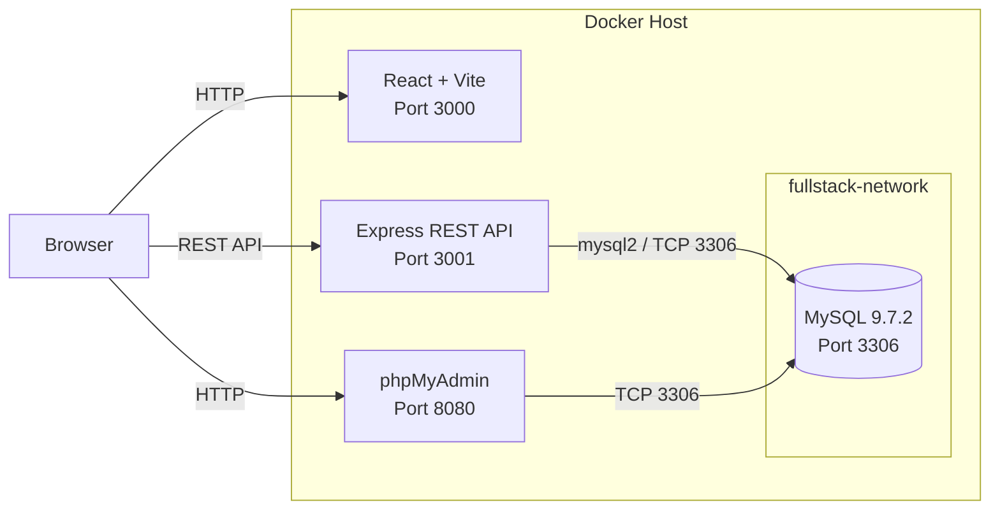

# Full-Stack Docker Compose CRUD Lab

[](https://www.docker.com/)
[](https://react.dev/)
[](https://expressjs.com/)
[](https://www.mysql.com/)
[](LICENSE)

A hands-on full-stack and DevOps lab that demonstrates how a React frontend, Express REST API, MySQL database, and phpMyAdmin can be containerized and orchestrated with Docker Compose.

The application implements a complete user CRUD workflow and is intentionally structured to demonstrate container networking, service health checks, persistent storage, environment-based configuration, and secure host-side port exposure.

> **Project scope:** this repository is a learning and portfolio project. The current frontend runs with the Vite development server and is not intended to represent a production deployment architecture yet.

## Highlights

- Complete **Create / Read / Update / Delete** user workflow
- React frontend connected to an Express REST API
- MySQL database with initialization SQL and persistent Docker volume
- MySQL health check before backend startup
- phpMyAdmin for database inspection and administration
- Internal Docker bridge network for service-to-service communication
- Environment variables stored outside source control
- Services published only on `127.0.0.1` on the Docker host
- Suitable for remote-lab access through SSH port forwarding
- Dockerized frontend and backend builds

## Architecture



### Request flow

```text
Browser
  ├── http://localhost:3000  -> React frontend
  ├── http://localhost:3001  -> Express API
  └── http://localhost:8080  -> phpMyAdmin
                                  |
Express backend -----------------+--> MySQL
                                       |
                                       +--> persistent named volume
```

The backend connects to MySQL using the Docker DNS hostname `mysql`, while the browser accesses the API through `localhost:3001` because the frontend JavaScript executes in the browser rather than inside the frontend container.

## Technology Stack

| Layer | Technology | Purpose |
|---|---|---|
| Frontend | React 19 + Vite 8 | User interface and browser-side API calls |
| Backend | Node.js 22 + Express 5 | REST API and application logic |
| Database client | mysql2 | Promise-based MySQL connection pool |
| Database | MySQL 9.7.2 | Persistent application data |
| DB administration | phpMyAdmin | Browser-based database inspection |
| Containers | Docker | Application packaging |
| Orchestration | Docker Compose | Multi-container lifecycle and networking |
| Networking | Docker bridge network | Service discovery and internal connectivity |
| Persistence | Docker named volume | MySQL data persistence |

## Project Structure

```text
fullstack-docker-compose/
├── .env.example
├── .gitignore
├── docker-compose.yml
├── LICENSE
├── README.md
│
├── backend/
│   ├── .dockerignore
│   ├── Dockerfile
│   ├── index.js
│   ├── package.json
│   └── package-lock.json
│
├── frontend/
│   ├── .dockerignore
│   ├── Dockerfile
│   ├── package.json
│   ├── vite.config.js
│   ├── public/
│   └── src/
│       ├── App.jsx
│       ├── App.css
│       ├── index.css
│       └── main.jsx
│
└── mysql/
    └── init.sql
```

## API Endpoints

| Method | Endpoint | Purpose | Typical success status |
|---|---|---|---|
| `GET` | `/health` | Check API and database connectivity | `200` |
| `GET` | `/users` | List users | `200` |
| `POST` | `/users` | Create a user | `201` |
| `PUT` | `/users/:id` | Update a user | `200` |
| `DELETE` | `/users/:id` | Delete a user | `200` |

Example health check:

```bash
curl http://127.0.0.1:3001/health
```

Expected response:

```json
{
  "status": "ok",
  "database": "connected"
}
```

Example user creation:

```bash
curl -X POST http://127.0.0.1:3001/users \
  -H "Content-Type: application/json" \
  -d '{"name":"Demo User","email":"demo@example.com"}'
```

## Database Initialization

On the first initialization of the MySQL data directory, Docker mounts:

```text
mysql/init.sql
```

into:

```text
/docker-entrypoint-initdb.d/01-init.sql
```

The script creates the `users` table and inserts sample records. The email column has a unique constraint.

Because MySQL data is stored in the named volume `fullstack_mysql_data`, application data survives normal container recreation.

```bash
docker compose down
docker compose up -d
```

The named volume is preserved by the commands above.

> Running `docker compose down -v` removes the named volume and therefore deletes the persisted MySQL data for this Compose project.

## Getting Started

### Prerequisites

Install:

- Git
- Docker Engine or Docker Desktop
- Docker Compose v2

Verify Docker Compose:

```bash
docker compose version
```

### 1. Clone the repository

```bash
git clone git@github.com:DerbSwag/fullstack-docker-compose.git
cd fullstack-docker-compose
```

HTTPS can also be used:

```bash
git clone https://github.com/DerbSwag/fullstack-docker-compose.git
cd fullstack-docker-compose
```

### 2. Create the environment file

```bash
cp .env.example .env
```

Then edit `.env` and replace the example credentials:

```dotenv
MYSQL_ROOT_PASSWORD=change_me
MYSQL_DATABASE=fullstack
MYSQL_USER=appuser
MYSQL_PASSWORD=change_me
```

The real `.env` file is excluded from Git by `.gitignore`.

### 3. Build and start the stack

```bash
docker compose up -d --build
```

### 4. Verify container status

```bash
docker compose ps
```

Expected services:

```text
fullstack-mysql
fullstack-backend
fullstack-frontend
fullstack-phpmyadmin
```

### 5. Test the backend

```bash
curl http://127.0.0.1:3001/health
curl http://127.0.0.1:3001/users
```

### 6. Open the application

| Service | URL |
|---|---|
| Frontend | `http://localhost:3000` |
| Backend API | `http://localhost:3001` |
| phpMyAdmin | `http://localhost:8080` |

## Remote VM Access with SSH Tunneling

The Compose file intentionally publishes the browser-facing services only on the Docker host loopback interface:

```yaml
127.0.0.1:3000:3000
127.0.0.1:3001:3001
127.0.0.1:8080:80
```

This prevents those application ports from being directly exposed on every network interface of a remote VM.

For a remote lab server, create an SSH tunnel from your workstation:

```bash
ssh -N \
  -L 3000:127.0.0.1:3000 \
  -L 3001:127.0.0.1:3001 \
  -L 8080:127.0.0.1:8080 \
  user@server
```

Then access the services from the workstation using the same localhost URLs.

## Docker Compose Design

### Service dependency

The backend does not start until MySQL reports healthy:

```text
mysql healthcheck
      |
      v
service_healthy
      |
      v
backend startup
```

This avoids relying only on container start order; the database must actually answer `mysqladmin ping` before Compose starts the backend.

### Internal service discovery

All services join the same Docker bridge network:

```text
fullstack-network
```

The backend therefore connects to the database using:

```text
DB_HOST=mysql
DB_PORT=3306
```

No MySQL host port needs to be published for backend-to-database communication.

### Persistence

MySQL stores its data at:

```text
/var/lib/mysql
```

which is backed by:

```text
fullstack_mysql_data
```

This separates the database lifecycle from the container lifecycle.

## Useful Operations

View running services:

```bash
docker compose ps
```

Follow backend logs:

```bash
docker compose logs -f backend
```

Follow database logs:

```bash
docker compose logs -f mysql
```

Rebuild only the backend after a code change:

```bash
docker compose up -d --build backend
```

Rebuild only the frontend:

```bash
docker compose up -d --build frontend
```

Stop and remove containers while keeping database data:

```bash
docker compose down
```

## Security Notes

This project includes several deliberate baseline practices:

- Real credentials belong in `.env`, which is excluded from Git.
- `.env.example` documents required variables without storing real secrets.
- Browser-facing ports bind to `127.0.0.1` instead of all host interfaces.
- MySQL is reachable internally through the Docker network and is not published to the host.
- SQL statements use parameter placeholders through `mysql2` for user-provided values.

For an Internet-facing production deployment, additional controls would still be required, including authentication, authorization, TLS termination, stricter CORS policy, secret management, validation, rate limiting, production frontend serving, observability, backups, and network/firewall policy.

## Current Development Status

| Capability | Status |
|---|---|
| Dockerized MySQL | ✅ |
| Dockerized Express backend | ✅ |
| Dockerized React frontend | ✅ |
| phpMyAdmin | ✅ |
| MySQL health check | ✅ |
| Persistent database volume | ✅ |
| CREATE user | ✅ |
| READ users | ✅ |
| UPDATE user | ✅ |
| DELETE user | ✅ |
| SSH-tunnel-friendly port exposure | ✅ |
| Production reverse proxy | Planned |
| Automated CI/CD | Planned |
| Automated tests | Planned |

## Roadmap

Planned improvements for the next stages of the lab:

1. Add **Nginx reverse proxy** and a single application entry point.
2. Replace the frontend Vite development server with a production build and static serving strategy.
3. Add **GitHub Actions CI/CD** for linting, build validation, and deployment workflow practice.
4. Add backend API tests and frontend tests.
5. Add stronger input validation and application-level error handling.
6. Add authentication and authorization.
7. Add production-grade secrets management and TLS.
8. Add monitoring, logging, and backup/restore procedures.

## What This Project Demonstrates

From a DevOps perspective, this lab demonstrates practical understanding of:

- Container image construction with Dockerfiles
- Multi-container orchestration with Docker Compose
- Container DNS and bridge networking
- Health-aware service dependencies
- Persistent state with Docker volumes
- Environment-based application configuration
- REST API integration across application tiers
- Localhost-only service publishing and SSH tunneling
- Git-based source control and repeatable deployment workflow

It is designed as a foundation that can be progressively extended toward reverse proxying, CI/CD, observability, and production-style deployment patterns.

## Author

**Nattawat (Derb)**  
GitHub: [@DerbSwag](https://github.com/DerbSwag)

## License

This project is licensed under the [Apache License 2.0](LICENSE).
