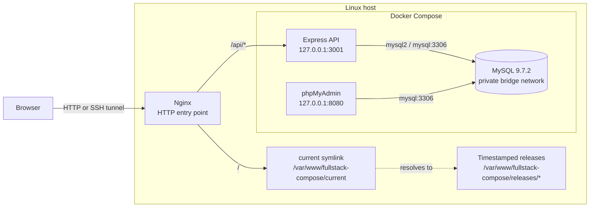
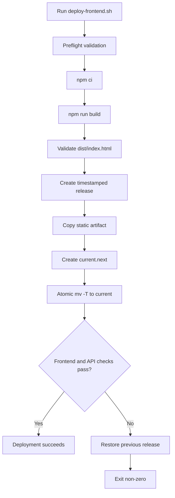

# Full-Stack Docker Compose Deployment Lab

[](https://docs.docker.com/compose/)
[](https://react.dev/)
[](https://expressjs.com/)
[](https://www.mysql.com/)
[](https://nginx.org/)
[](LICENSE)

A compact full-stack CRUD application demonstrating release-oriented deployment on a Linux host. React is compiled into static assets, promoted through timestamped releases, and served by host-level Nginx. Express, MySQL, and phpMyAdmin remain Docker Compose services.

This is a production-style portfolio lab, not a claim of complete production readiness. The repository includes build validation, atomic activation, health checks, and automatic frontend rollback. It does not include CI/CD, TLS, authentication, automated application tests, monitoring, or database backup automation.

## Overview

The application provides a React UI for user CRUD operations and an Express REST API backed by MySQL.

```text
Browser
  ---
  ---
Host-level Nginx
  --------- /       --- active React release
  --------- /api/* --- Express on 127.0.0.1:3001
                         ---
                         ---
                       MySQL
```

phpMyAdmin is available on `127.0.0.1:8080`. MySQL is reachable by application services through the private Docker bridge network and is not published on a host port.

## Architecture



| Component | Runtime | Responsibility |
| --- | --- | --- |
| React | Host filesystem under active release | Browser UI |
| Nginx | Linux host | Static serving and API reverse proxy |
| Express | Docker Compose | CRUD API and database access |
| MySQL | Docker Compose | Persistent application data |
| phpMyAdmin | Docker Compose | Database administration |

The host Nginx site configuration is external to this repository. The operator must configure it to serve `current` and proxy `/api/` to `127.0.0.1:3001`.

## Deployment Flow



## Release Strategy

Releases are stored under:

```text
/var/www/fullstack-compose/releases/YYYYMMDD-HHMMSS
```

Nginx reads through:

```text
/var/www/fullstack-compose/current
```

The script builds from the checked-out revision, validates `frontend/dist/index.html`, copies the build into a new release, and switches the symlink with `mv -T`.

This gives the deployment a clear release boundary:

- Build output is prepared before activation.
- A complete directory exists before Nginx can serve it.
- The active version is auditable with `readlink -f`.
- The previous release remains available as a recovery target.
- Cleanup is not mixed into the deployment transaction.

The script does not rebuild or recreate Express, MySQL, or phpMyAdmin. It does not delete old releases, prune Docker resources, or remove database data.

## Rollback Strategy

Rollback is a frontend release-pointer rollback. After activation, the script checks:

```bash
curl -fsS -o /dev/null http://127.0.0.1/
curl -fsS -o /dev/null http://127.0.0.1/api/users
```

If either request fails, the previous release is selected through a temporary symlink and moved over `current`. The script verifies the restored target and exits non-zero.

This does not undo database writes. MySQL remains in the `fullstack_mysql_data` named volume, and database recovery is outside the frontend deployment transaction.

## Controlled Rollback Test

The preferred lab test introduces a controlled HTTP/API failure while keeping the backend process running. This validates the deployment failure branch without intentionally stopping the application service.

The exact failure-injection command depends on the active host Nginx configuration, which is external to this repository. Temporarily make the API check fail through the Nginx path, run the deployment, and then restore the normal route.

Expected result:

1. The frontend build completes.
2. A new release is created and activated.
3. The controlled API request fails.
4. The previous release is restored atomically.
5. The deployment exits non-zero.
6. The HTTP fault is removed.
7. Frontend and API return healthy responses.

The checked-in script implements the rollback branch. The HTTP fault injection is environment-specific because the Nginx configuration is not stored here.

`docker compose stop backend` is not the default demonstration for this scenario. It remains a valid outage test, but it tests backend unavailability rather than an HTTP-layer controlled failure.

## Services and API

### Express

The backend listens on port `3001` and is published on `127.0.0.1:3001`.

| Method | Route | Purpose |
| --- | --- | --- |
| `GET` | `/health` | Query MySQL and report dependency status |
| `GET` | `/users` | List users |
| `POST` | `/users` | Create a user |
| `PUT` | `/users/:id` | Update a user |
| `DELETE` | `/users/:id` | Delete a user |

Through Nginx:

```bash
curl http://127.0.0.1/api/health
curl http://127.0.0.1/api/users
```

The API uses a MySQL pool, parameterized SQL queries, JSON request parsing, and validation for required `name` and `email` values.

### MySQL

MySQL uses `mysql:9.7.2`. On first initialization, `mysql/init.sql` creates the `users` table, applies a unique email constraint, and inserts sample records.

```text
fullstack_mysql_data --- /var/lib/mysql
```

`docker compose down` preserves the named volume. `docker compose down -v` removes it and deletes persisted project data.

### phpMyAdmin

phpMyAdmin uses `PMA_HOST=mysql` and `PMA_PORT=3306`. It is published only on `127.0.0.1:8080` and should remain restricted to administrative access.

## Repository Structure

```text
.
|-- backend/
|   |-- Dockerfile
|   |-- index.js                 # Process entry point and shutdown handling
|   |-- package.json
|   |-- package-lock.json
|   `-- src/
|       |-- app.js               # Express app and health endpoint
|       |-- db.js                # MySQL pool factory
|       |-- http.js              # Validation and error helpers
|       `-- routes/users.js      # User CRUD routes
|-- frontend/
|   |-- Dockerfile               # Retained image definition; not production path
|   |-- index.html
|   |-- package.json
|   |-- package-lock.json
|   |-- vite.config.js
|   `-- src/
|       |-- api/users.js         # Browser API client
|       |-- components/
|       |   |-- UserForm.jsx
|       |   `-- UserList.jsx
|       |-- App.jsx
|       |-- App.css
|       |-- index.css
|       `-- main.jsx
|-- mysql/init.sql
|-- scripts/deploy-frontend.sh
|-- docker-compose.yml
|-- .env.example
|-- LICENSE
`-- README.md
```

Vite remains the frontend build tool and local development server. The production path uses `npm run build` and host-level Nginx; it does not use the Vite development server.

## Configuration

```bash
cp .env.example .env
```

| Variable | Purpose |
| --- | --- |
| `MYSQL_ROOT_PASSWORD` | MySQL root credential |
| `MYSQL_DATABASE` | Application database name |
| `MYSQL_USER` | Application database user |
| `MYSQL_PASSWORD` | Application database password |

The real `.env` file is ignored by Git. Use non-placeholder values outside source control. Compose supplies the backend with `PORT=3001`, `DB_HOST=mysql`, `DB_PORT=3306`, and credentials derived from this file.

## Operations

### Start services

```bash
docker compose up -d --build
docker compose ps
```

MySQL uses `mysqladmin ping` for readiness. Backend and phpMyAdmin depend on MySQL being `service_healthy`. The backend also has a container healthcheck against `/health`.

### Configure Nginx

```nginx
root /var/www/fullstack-compose/current;

location / {
    try_files $uri $uri/ /index.html;
}

location /api/ {
    proxy_pass http://127.0.0.1:3001/;
}
```

```bash
sudo nginx -t
sudo systemctl reload nginx
```

### Deploy frontend

```bash
sudo mkdir -p /var/www/fullstack-compose/releases
cd "$HOME/fullstack-compose"
bash scripts/deploy-frontend.sh
```

An initial release and valid `current` symlink must exist before the first deployment. The script requires `npm`, `curl`, standard Linux symlink/rename utilities, and passwordless `sudo`.

### Verify

```bash
readlink -f /var/www/fullstack-compose/current
test -s /var/www/fullstack-compose/current/index.html
curl -fsS http://127.0.0.1/
curl -fsS http://127.0.0.1/api/health
curl -fsS http://127.0.0.1/api/users
```

### Inspect releases and logs

```bash
ls -1 /var/www/fullstack-compose/releases
ls -l /var/www/fullstack-compose/current*
docker compose logs --tail=100 backend mysql phpmyadmin
```

Release cleanup is not automated. Remove old releases only through a separately reviewed procedure.

### SSH access

```bash
ssh -N -L 8081:127.0.0.1:80 user@server
```

Open `http://127.0.0.1:8081`. Forward phpMyAdmin separately when required:

```bash
ssh -N -L 8080:127.0.0.1:8080 user@server
```

## Runbook

### Normal deployment

1. Confirm the Git revision to deploy.
2. Confirm backend and MySQL health.
3. Record the active release.
4. Run `scripts/deploy-frontend.sh`.
5. Review build, switch, and health output.
6. Verify `/`, `/api/health`, and `/api/users`.
7. Record the new release identifier.

### Failed deployment

1. Treat a non-zero script exit as a failed deployment.
2. Read the first `ERROR:` line.
3. Confirm `current` resolves inside `releases`.
4. Inspect Nginx and backend logs.
5. Verify frontend and API responses.
6. Do not delete the failed release before investigation.
7. Retry only after identifying the cause.

### HTTP rollback test

1. Use a maintenance window or isolated host.
2. Record the active release.
3. Introduce a temporary API-path failure at the HTTP/Nginx test boundary.
4. Keep the backend process running.
5. Run the frontend deployment script.
6. Confirm the API check fails.
7. Confirm `current` returns to the previous release.
8. Confirm the command exits non-zero.
9. Remove the temporary fault.
10. Verify frontend and API health.

The exact fault-injection command is environment-specific because the host Nginx configuration is external to this repository.

### Database preservation

```bash
docker compose down
docker compose up -d
```

The named volume is preserved. Adding `-v` is destructive for persisted project data.

## Development

### Frontend

```bash
cd frontend
npm ci
npm run dev
npm run lint
npm run build
```

`npm run dev` is local development only. `npm run build` creates the artifact consumed by the release script.

### Backend

```bash
cd backend
npm ci
npm start
```

The backend expects `PORT`, `DB_HOST`, `DB_PORT`, `DB_NAME`, `DB_USER`, and `DB_PASSWORD`.

### Validation

```bash
bash -n scripts/deploy-frontend.sh
docker compose config
```

The repository does not include a real automated test suite. The backend `test` script remains a placeholder.

## Security

Current baseline controls:

- `.env` is excluded from Git.
- `.env.example` contains placeholders only.
- MySQL has no host port mapping.
- Backend and phpMyAdmin bind to host loopback.
- SSH forwarding can provide restricted remote access.
- SQL values use parameter placeholders.
- Release targets are validated under `releases`.
- Deployment does not delete old releases or database volumes.

Current limitations:

- CORS is enabled broadly.
- phpMyAdmin uses the `latest` image tag.
- No TLS configuration is included.
- No authentication or authorization is included.
- No rate limiting is included.
- No external secret manager is configured.
- No backup/restore automation is included.
- No centralized observability stack is included.

These limitations prevent the repository from being described as a fully hardened Internet-facing production service.

## Failure Boundaries

The frontend script can roll back static release selection. It does not roll back the backend process, MySQL data, host Nginx configuration, or host package state.

Automatic recovery is intentionally scoped to the frontend release pointer.

## Roadmap

The following are future improvements, not current capabilities:

- CI checks for frontend build, lint, Compose syntax, and shell syntax.
- Backend API tests and frontend component tests.
- Pin phpMyAdmin to a reviewed image version.
- Stronger request validation and error contracts.
- Authentication and authorization.
- TLS and managed secret storage.
- Metrics, logs, alerting, and deployment observability.
- Release retention and explicit cleanup tooling.
- Database backup, restore, and recovery validation.
- Blue-green backend deployment evaluation.
- Canary traffic evaluation for multi-instance deployments.
- Runtime screenshots under `docs/images/` after capture from the lab.

## Portfolio Highlights

This repository demonstrates:

- React static build and artifact-based deployment.
- Host-level Nginx as the application entry point.
- Path-based routing for static assets and API traffic.
- Express CRUD API backed by MySQL.
- Docker Compose orchestration.
- Health-aware database dependencies.
- Private database networking.
- Persistent named-volume storage.
- Timestamped frontend releases.
- Atomic symlink activation.
- Post-deploy frontend and API checks.
- Automatic frontend rollback.
- Controlled HTTP-layer rollback validation in the lab.
- Explicit separation between frontend rollback and database recovery.

The strongest portfolio signal is the operational design around repeatable release creation, atomic activation, health validation, and recovery under controlled failure.

## Interview Summary

### Why static frontend deployment?

The compiled frontend is a static artifact. Serving it directly through host Nginx removes an unnecessary production process and gives deployment a clear artifact boundary.

### Is this blue-green deployment?

The frontend has a blue-green-like pointer switch, but the repository does not implement two live environments or traffic splitting. The accurate term is atomic release deployment with automatic rollback.

### Is this zero-downtime deployment?

The repository demonstrates atomic frontend activation on one host. It does not prove multi-node zero-downtime behavior, backend blue-green deployment, or canary routing.

### What does health validation prove?

It proves basic frontend and API availability after activation. The API health endpoint also checks a simple MySQL query. These checks do not prove full business correctness, capacity, or resilience under load.

## Evidence Map

| Evidence | Location | Demonstrated behavior |
| --- | --- | --- |
| Static build | `frontend/package.json` | `npm run build` invokes Vite |
| Release deployment | `scripts/deploy-frontend.sh` | Build copied to timestamped directory |
| Atomic activation | `scripts/deploy-frontend.sh` | `current.next` moved over `current` |
| Automatic rollback | `scripts/deploy-frontend.sh` | Failed checks restore old release |
| API health | `backend/src/app.js` | MySQL query validates dependency |
| API CRUD | `backend/src/routes/users.js` | User CRUD routes |
| Compose readiness | `docker-compose.yml` | Services depend on MySQL health |
| Persistence | `docker-compose.yml` | Named volume backs MySQL data |

## Documentation Maintenance

Update this README when service boundaries, ports, environment variables, deployment stages, or rollback behavior change.

Do not describe the Vite development server as production runtime.

Do not describe the removed frontend Compose service as active.

Do not describe a manual rollback test as CI automation.

Keep recruiter-facing claims tied to checked-in files or recorded lab evidence.

## License

This project is licensed under the [Apache License 2.0](LICENSE).
